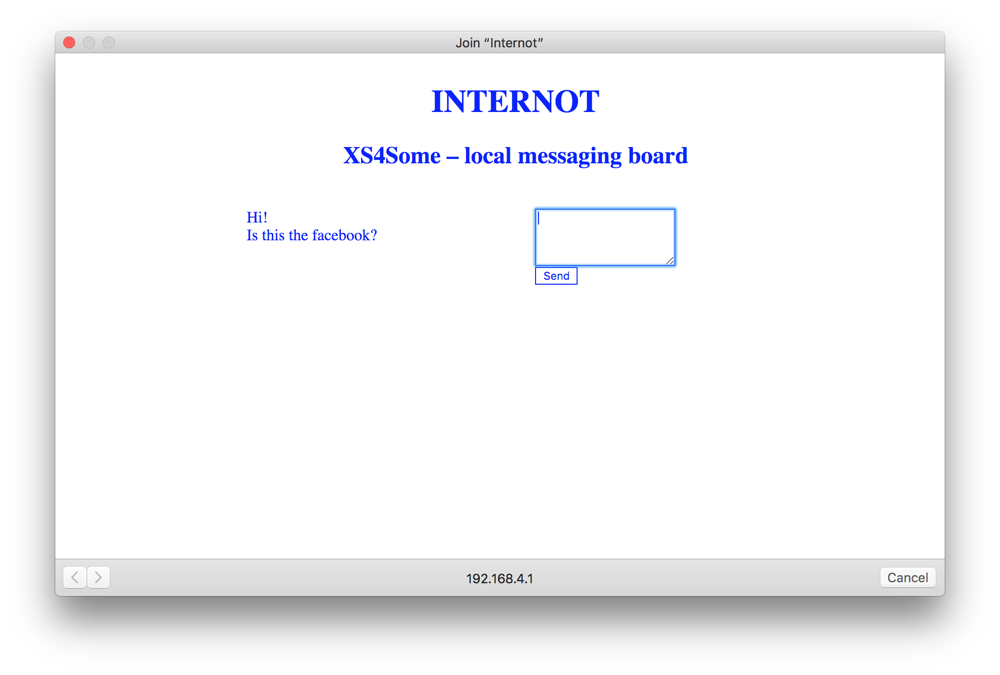

Internot
======
**Internot** is a super simple localized message board running on the captive network welcome screen running on an ESP32.
Inspired by the [Walking Signals Wifi Zine Workshop](https://hackersanddesigners.nl/s/Events/p/Walking_Signals_Wifi_Zine_Workshop) by [Dianaband](https://github.com/dianaband) at [Hackers&Designers](https://hackersanddesigners.nl/)
It uses SPIFFS to permanently store the messages.

#### Screenshot


## Usage
```
$ git clone https://github.com/swummoq/ESP32_internot.git
```
See [How-to](#how-to-use-this-code) below.

## License
* The code is based on the ESP32 Arduino examples.
* LPGL-3.0

## Version
* Version 0.1

## How-to use this code
* Install the ESP32 boards as per https://github.com/espressif/arduino-esp32/tree/master/docs/arduino-ide
* Install ArduinoJSON (in the IDE by going to Sketch > Include Library > Manage Libraries... > Search arduinoJson > Click install.
* Upload Internot.ino to the ESP32
* Optionally, change the filename of the internot.ssid file to something else (keeping the .ssid extension) to change the network's SSID.
* (If necessary) modify the webpage
* Upload the files to ESP32 by using Tools > ESP32 Sketch Data Upload
* Connect to the new "Internot" wifi network
* **Important note**: (Re)uploading the HTML files also wipes the stored comments!

## Todo
* Add escaping/filtering/validation to the input. This just a quick prove of concept, it does no filtering/validation on any of the input. Horrible things will probably happen if you try to input weird characters.
